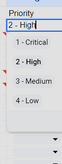
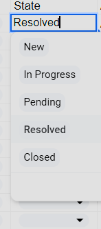
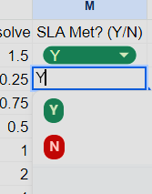
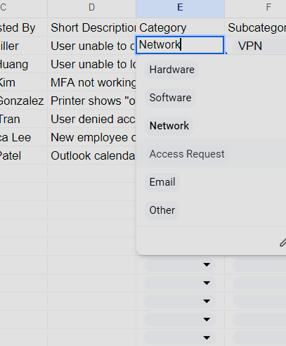
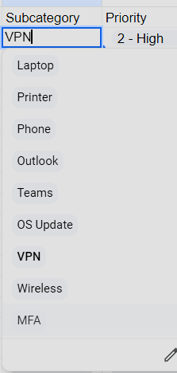
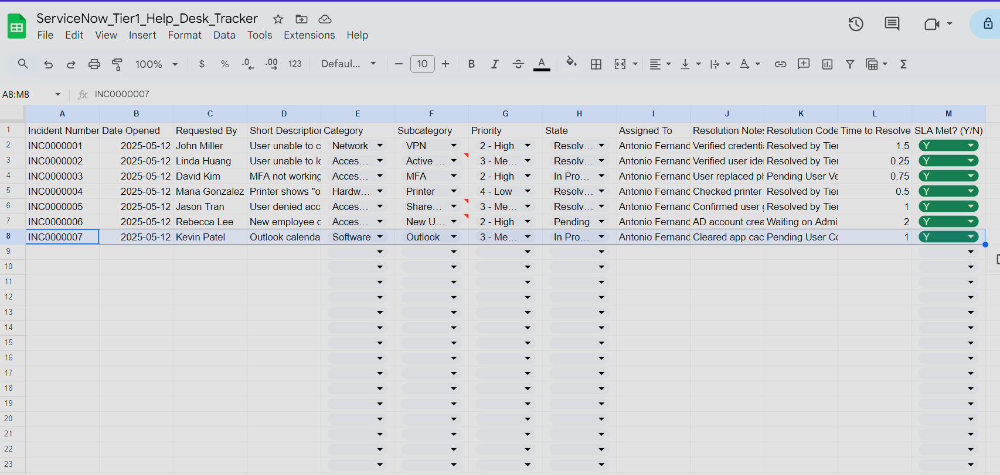

# ServiceNow Tier 1 Helpdesk Simulation

This project simulates a realistic ServiceNow-style ticketing system for Tier 1 IT support. It includes 7 fully documented incident scenarios covering common issues such as VPN access problems, MFA failures, password resets, shared drive permissions, and Outlook sync errors.

## 🧰 Project Features

- Incident tracking with ServiceNow-style formatting
- Dropdown-based fields for Priority, State, Category, and SLA status
- Resolution notes, escalation status, and SLA compliance logging
- Covers core Tier 1 troubleshooting scenarios and ITIL-aligned workflows

## 📂 Files Included

- `ServiceNow_Tier1_Help_Desk_Tracker.xlsx` – Full version with dropdowns and formatting
- `ServiceNow_Tier1_Help_Desk_Tracker.csv` – Raw version for quick preview

## 📸 Dropdown Previews

These screenshots show the custom dropdowns configured for realistic incident management:

**Priority Dropdown**  

**State Dropdown**  

**SLA Met Dropdown**  

**Category Dropdown**  

**Subcategory Dropdown**  

**Full Tracker Preview**  

